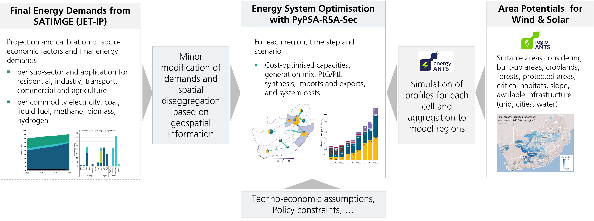

<!--
SPDX-FileCopyrightText:  PyPSA-RSA-Sec, PyPSA-RSA, PyPSA-Eur and PyPSA-Earth Authors

SPDX-License-Identifier: AGPL-3.0-or-later
-->

# Development Status: **Under development**

# PyPSA-RSA-Sec: A Sector-Coupled Open Optimisation Model of the South African Energy System

PyPSA-RSA-Sec is an open multi-sector, multi-regional, hourly-resolved model and dataset of the South African Energy System. This sector-coupled version is designed to conduct long-term expansion planning studies from 2030 to 2050 under different techno-economic scenario assumptions and policy targets. 

[Fraunhofer IEE](https://www.iee.fraunhofer.de/) and [Stellenbosch University](https://grid.sun.ac.za/) leveraged and built on [PyPSA-RSA](https://github.com/MeridianEconomics/pypsa-rsa/tree/master), currently developed by [Meridian Economics](https://meridianeconomics.co.za/), and [PyPSA-Earth](https://github.com/pypsa-meets-earth/pypsa-earth), to set up the first customised, multi-regional, hourly-resolved energy model with sector-coupling and Power-to-X features for South Africa. The model was used to identify and evaluate promising pathways for the expansion and utilisation of renewable energy and Power-to-X (PtX) as part of the [PtX Allocation Study for South Africa](https://www.iee.fraunhofer.de/en/research_projects/search/2023/ptx-south-africa.html) supported by the [International PtX Hub](https://ptx-hub.org/), [Agora Industry](https://www.agora-industry.org/), [CSIR](https://www.csir.co.za/), and valuable feedback from various stakeholders. As part of the study, potential areas for renewable energies and electrolysis are identified and renewable generation profiles are generated using the [energyANTS](https://www.iee.fraunhofer.de/de/anwendungsfelder/energieprognosen/energiesystemsimulation.html) tool. The projection of sectoral final energy demands is based on the datasets published by the University of Cape Town as part of their modelling work for the [Just Energy Transition Investment Plan (JET-IP, 2022)](https://www.climatecommission.org.za/south-africas-jet-ip) study.

### Features

* Utilises open data, a workflow management system with central configuration files and the open source toolbox [PyPSA](https://pypsa.readthedocs.io/en/latest/index.html), facilitating collaboration, encouraging the open exchange of model data, and enabling the comparison of model results. Users can also employ the cleaned and processed data in their own custom optimisation models.
* Designed to evaluate different, cost-optimised, long-term scenarios for the expansion and utilisation of renewable energy and Power-to-X.
* Covers the energy and feedstock demands of transport, industry, residential, commercial, agriculture, and fuel export subsectors.
* Spatial resolution is based on the 11 regions defined by the [GCCA 2024 Eskom Transmission Supply Regions](https://www.ntcsa.co.za/wp-content/uploads/2024/07/Generation-Connection-Capacity-Assessment-GCCA-2024.pdf).
* Co-optimises dispatch and capacity expansion from 2030 to 2050 for generation, conversion, and storage technologies, as well as high-voltage transmission lines and new hydrogen pipelines.
* By default, the model uses full chronology (8760 hours per year), but the number of snapshots can be reduced through time-series segmentation using the [Time series aggregation module (tsam)](https://github.com/FZJ-IEK3-VSA/tsam/).
* Considers several flexibility options, such as battery storage, hydrogen steel tank storage, optimised electrolyser load, and demand-side management for electric vehicles.
* Provides a new custom renewable potential area analysis along with aggregated wind and solar profiles for the 11 supply regions of the GCCA 2024.

### Limitations and Future Research

PyPSA-RSA-Sec is a simplified representation of the real world (like all computer models), and several aspects could be improved through ongoing research and collaborations:

* Focuses on high-voltage line expansion with an N-1 approximation, excluding vertical measures such as substations and the provision of system services (e.g. reactive power, instantaneous reserve).  
* Does not consider potential cooperation with neighbouring SADC countries via imports or exports.  
* Uses simplified regionalisation of sectoral demands for residential, agriculture and road or rail transport demands (Gross Value Added, population) and todays electricity or static load profiles; sub-sector specific load patterns remain for future work.  
* Excludes costs and infrastructure for domestic transport of methane, carbon dioxide, water, biomass, ammonia.  
* Currently models only selected PtX exports (ammonia and Fischer-Tropsch fuels); modelling the ramp up of other higher-value products remain for future work (green hot briquetted iron (HBI), DRI, urea, methanol).
* Aggregates certain PtX production aspects (e.g. Fischer-Tropsch yields multiple fuels but is treated as a single product).  
* Does not address socio-economic factors (e.g. job effects).  

PyPSA-RSA-Sec evolved from the December 2023 version of PyPSA-RSA and remains under active development, with plans to merge the versions as funding becomes available.

# Installation

### Prerequisites

Software prerequisites for the model include [Git](https://github.com/git-guides/install-git) and either the mamba or conda Python package and environment manager. We recommend using mamba as a faster alternative to conda. To use mamba, download and install the [Miniforge distribution](https://github.com/conda-forge/miniforge) and follow the Miniforge README instructions to set up mamba. Alternatively, you can install and use the [conda-libmamba-solver](https://github.com/conda/conda-libmamba-solver).

Hardware-wise, a single optimisation run performs well with 4-16 CPU threads. Solving a complete set of scenarios benefits from parallelisation and additional threads. RAM requirements vary based on the model's complexity. A multi-sector, 11-region capacity expansion planning model for one year with 8760 hours requires around 20 GB of RAM.

### Steps

1. **Clone the Git repository**:  `git clone git@github.com:ljansen-iee/pypsa-rsa-sec.git` 
2. **Enter the project folder**: `cd pypsa-rsa-sec`
3. **Set up the python environment**: 
The python package requirements are listed in the `envs/environment.yaml` file. To set up the environment, run: `mamba env create -f envs/environment.yaml`. 
1. **Install a solver**. PyPSA-RSA-Sec forms mathematical equations at its core, which need to be solved by a numerical solver to produce an optimised result. While open source solvers such as [HiGHS](https://highs.dev/) and [CBC](https://github.com/coin-or/Cbc) can handle smaller problems, a commercial solver is likely to be required to solve multi-sector, multi-regional capacity expansion models in a reasonable time. Suitable options include: 
   * [Gurobi](https://www.gurobi.com/)
   * [IBM CPLEX](https://www.ibm.com/products/ilog-cplex-optimization-studio/cplex-optimizer)
   * [FICO Xpress](https://www.fico.com/en/products/fico-xpress-optimization)
   * [COPT](https://www.shanshu.ai/copt)
   * [MindOpt](https://opt.alibabacloud.com/)
2. **Download the input datasets**:
A wide range of input data is required to run the model. Download both original and prepared datasets from [Owncloud](https://owncloud.fraunhofer.de/index.php/s/Al43g5c6Gp7EcJw). Download and copy the folders `pypsa-rsa-sec/data/bundle` and `pypsa-rsa-sec/cutouts`. By downloading, the user accepts the [licenses](#licenses) of the original sources. 

# Usage
  
PyPSA-RSA-Sec is built upon the fundamental components in the [PyPSA library](https://pypsa.org/). It is recommended that you familiarising yourself with the [PyPSA documentation](https://pypsa.readthedocs.io/en/latest/index.html) before diving into this model. The electricity-sector model PyPSA-RSA is further documented here: [PyPSA-RSA documentation](https://pypsa-za.readthedocs.io/en/latest/). A two-part video series on using PyPSA and PyPSA-RSA is available at [this link](https://meridianeconomics.co.za/our-publications/pypsa-rsa-workshop1/). For questions or bug reports, please join the Discord channels or email in the section [Collaboration](#collaboration). 

### Configuration

PyPSA-RSA-Sec is designed for flexible configuration and can be run with Snakemake from the command line. The file `config/config.yaml` specifies the scenario matrix to be processed and sets global config parameters for the entire run. 

To customise individual scenarios, edit the Excel file `config/model_file.xlsx`, where you can specify scenario wildcards and define important scenario-specific parameters for each scenario wildcard (scenario name). The entries in `config.yaml` and `model_file.xlsx` determine which scenarios are included, how they are set up, and which model options are activated.

Advanced users may further refine or replace datasets (e.g. `data/bundle/geospatial/industrial_database.csv`) or create a separate `config.yaml` if needed.

### Execution

To run the whole model workflow, [snakemake<=7.32](https://snakemake.readthedocs.io/en/v7.32.3/) is used. 

    (pypsa-rsa-sec) .../pypsa-rsa-sec$ snakemake solve_sector_scenario_matrix -j4
 
For the execution on a HPC adjust the slurm cluster parameters in `config/config.cluster.yaml`. Then run the bash script:

    (pypsa-rsa-sec) .../pypsa-rsa-sec$ bash run_slurm.sh

# Collaboration

Collaborations are welcome! Please do not hesitate to reachout for collaboration or feature ideas, questions or bug reports on one of the following channels:

- Join the [PyPSA-RSA Discord Channel](https://discord.gg/bsdHkHwujt).
- Contact the Fraunhofer IEE for bug reports or questions about the customized sector-coupled model PyPSA-RSA-Sec: [ptx-pathways@iee.fraunhofer.de](mailto:ptx-pathways@iee.fraunhofer.de).
- You can submit a pull request directly if you already have some code changes.
- For broader discussions and inspiration, join the [PyPSA-meets-Earth Discord community](https://discord.gg/AnuJBk23FU).

# Developers

The inital [PyPSA-ZA model](https://arxiv.org/pdf/1710.11199.pdf) was developed by Jonas Hörsch and Joanne Calitz in 2017 within the Energy Centre at the [Council for Scientific and Industrial Research (CSIR)](https://www.csir.co.za/) as part of the [CoNDyNet project](https://fias.institute/en/projects/condynet/), funded by the [German Federal Ministry of Education and Research](https://www.bmbf.de/bmbf/en/home/home_node.html) under grant no. 03SF0472C. [Meridian Economics](http://meridianeconomics.co.za) extended PyPSA-ZA, developed and currently maintains [PyPSA-RSA](https://github.com/MeridianEconomics/pypsa-rsa/tree/master). Fraunhofer IEE and Stellenbosch University built on PyPSA-RSA to develop the first  South African specific multi-regional sector-coupled expansion planning model PyPSA-RSA-Sec. 
Credits and thanks go to the authors and the PyPSA community of [PyPSA-Eur](https://github.com/PyPSA/pypsa-eur) and [PyPSA-Earth](https://github.com/pypsa-meets-earth/pypsa-earth), as the South African specific PyPSA models are largely based on the functions of these models. 

# Licenses

PyPSA-RSA-Sec is released under several licenses. The source code of PyPSA-RSA-Sec is released under the license [AGPL-3.0-or-later](./licenses/AGPL-3.0-or-later.txt) license. Intermediate and result data files are released under the [CC-BY-4.0](./licenses/CC-BY-4.0.txt) license. In addition, different licenses and terms of use apply to the different input datasets. By downloading and using the data provided, the user of the model agrees to the licenses specified by the original sources. 